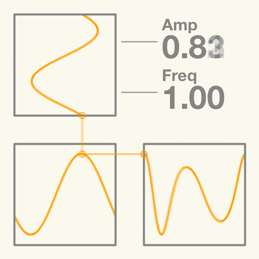

# Everyday One Motion - 20160218 "Frequency Modulation Synthesis"

Processing

[Everyday One Motion](http://motions.work/motion/98)  

## Frequency Modulation Synthesis

今回は、シンセサイザの波形合成アルゴリズムの中でも難解とされる、FMシンセシスを紹介したいと思います。  
私の所属する、明治大のFMS（= Frequency Modulation Synthesis）学科では、FMシンセにおけるより多彩で美しい音色を合成することを目指し、昼夜研究を続けています。大嘘です。  

### Frequency Modulation

減算合成シンセシスと呼ばれる、一般的なシンセサイザの波形合成方式では、波形をサイン波・ノコギリ波・矩形波などから選択し、それに対してフィルターやアンプなどといった処理を施すことにより音を作ります。  
FMシンセシスでは、主にサイン波同士の組み合わせで音を作りますが、単なる足し算で組み合わせるのではなく、周波数変調というアルゴリズムを用いて組み合わせます。  
これによりFMシンセシスは、減算合成では難しい、鐘のような金属的な音などを得意とします。  

このGIFアニメーションでは、左上の波形をモジュレータ、左下の波形をキャリアと呼び、右下の波形が出力波形です。  
モジュレータとキャリアの波形は単純なサイン波ですが、このふたつを組み合わせた出力波形はとても複雑であることがわかると思います。  

まず、モジュレータのAmp（音量）が0の場合、キャリアのサイン波がそのまま出力されます。  
モジュレータのAmpを上げていくと、モジュレータ波形に応じてキャリアの位相が変化します。これにより、出力波形がサイン波から歪んでいくことがわかると思います。  
さらに、モジュレータのFreq（周波数）を上げていくと、波形がより複雑に変化します。  

このようにFMシンセシスでは、モジュレータのAmp、Freqにより、出力波形が多彩に変化します。  
この変化の仕方が（比較的）直感的でなく、予想に反した変化をすることから、FMシンセシスは難しいとよく言われます。  
さらに、実際のFMシンセシスでは、より多くのサイン波を組み合わせて音を作れるため、難しい反面可能性は無限大です。  
